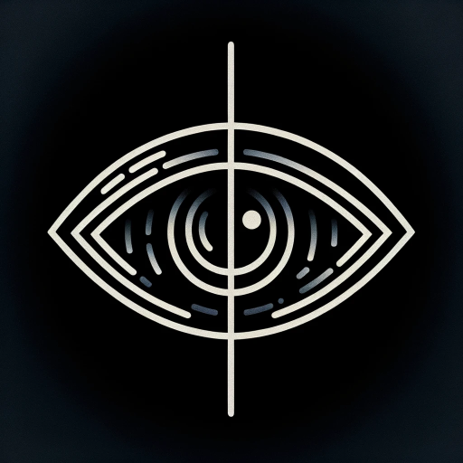

<h1 align="center">Discord Spoiler Text Converter</h1>

Convert your text to Discord Spoiler Text in an instant

---

## What is this?

This is a simple web app that converts your text to Discord Spoiler Text. You can use this to convert your text to Discord Spoiler Text and then copy it to your clipboard all through the click of buttons.

## How to use?

1. Visit the website [here](https://discord-spoiler-text-converter.thepushkarp.com/).
2. Enter your text in the input box.
3. Click on the "Convert to Discord Spoiler Text" button.
4. Your text will be converted to Discord Spoiler Text.
5. Click on the "Copy to Clipboard" button to copy the converted text to your clipboard.

## LICENSE

This project is licensed under the MIT License. See the [LICENSE](LICENSE) file for more details.

---

  <a href="https://github.com/thepushkarp/discord-spoiler-text-converter" target="_blank" rel="noopener noreferrer">
    Discord Spoiler Text Converter
  </a>
  made with ❤️ by
  <a href="https://github.com/thepushkarp">
    Pushkar  Patel
  </a>

